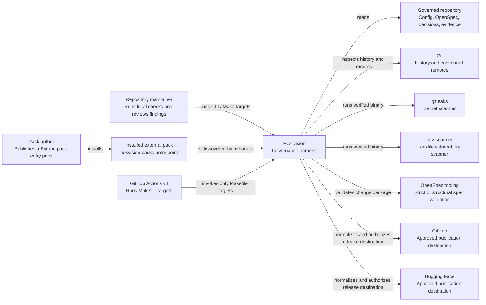

# C4 Level 1 — System context

**Audience:** maintainers, pack authors, release engineers, and safety reviewers
**Classification:** technical architecture

Hex-vision is a repository governance harness. A maintainer runs it locally or in CI; a pack author adds a separately installable stack integration. The harness reads local evidence, uses Git only as repository evidence, and invokes configured scanners or tooling as subprocesses. It never commands a robotics system.

A successful check is evidence that a configured policy was evaluated; it is not a release authorization. Publication is separately gated by the shared remote policy and an authoritative `G-PUB` decision-log record.
