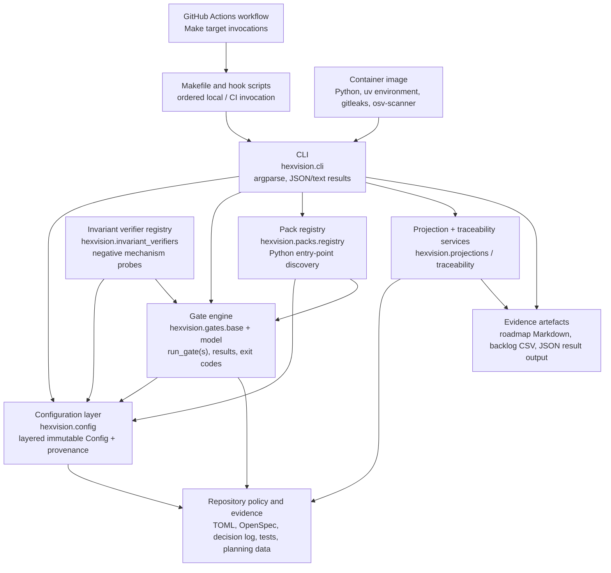

# C4 Level 2 — Containers

**Audience:** maintainers, pack authors, release engineers, and security reviewers
**Classification:** technical architecture

Hex-vision is one Python application package with a CLI front door. The repository supplies its policy and generated evidence; Make and CI are orchestration containers rather than a second implementation of gate logic. The `Dockerfile` packages the same application and verified scanner binaries for isolated command execution.

The configuration layer is shared by all runtime components. It merges packaged defaults, repository and `pyproject.toml` policy, environment variables, and explicit overrides while rejecting overrides to frozen prefixes. `scanner_identity` is a supporting module used by Make to resolve a scanner path and verify the bytes before invocation.
