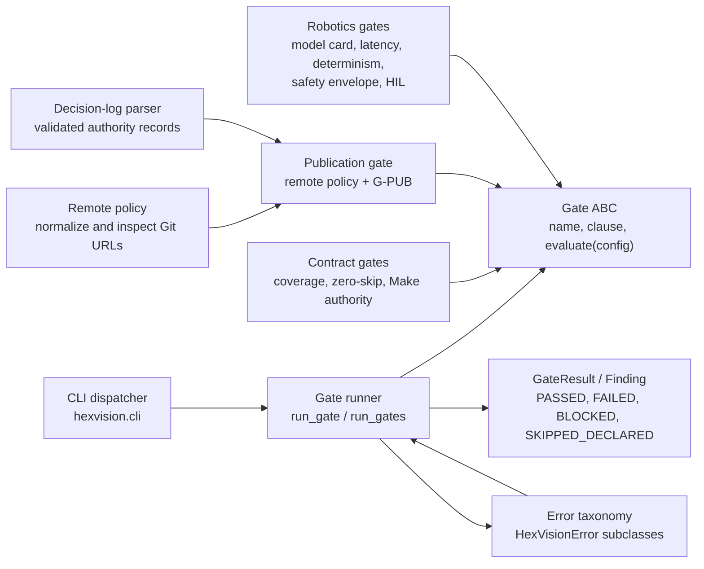
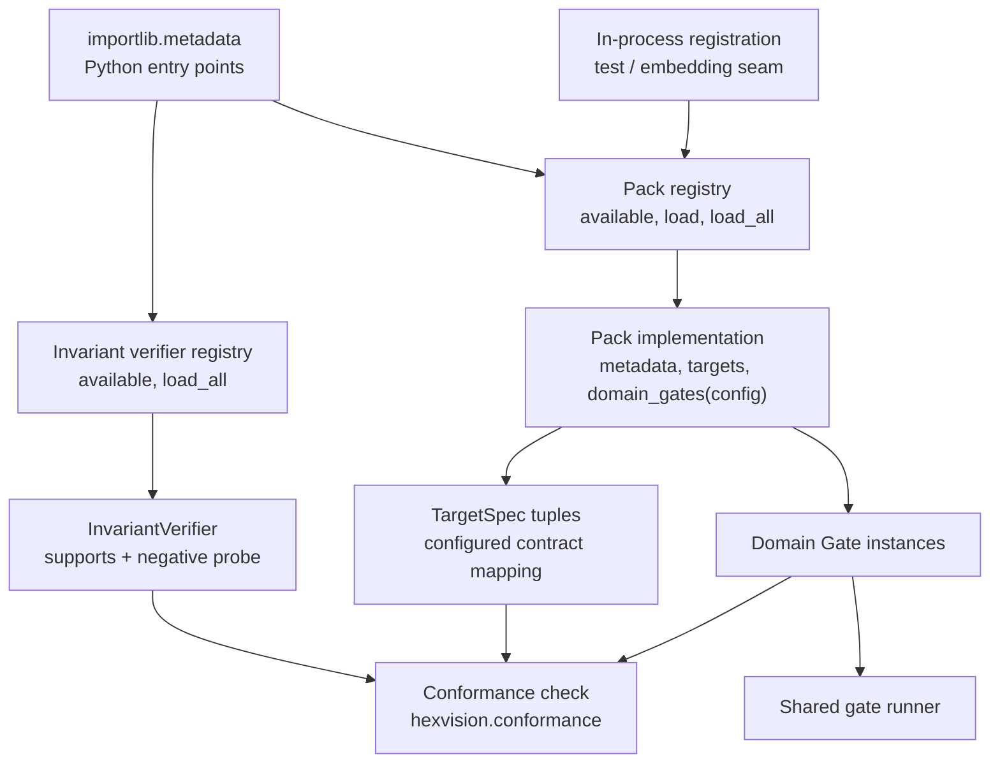
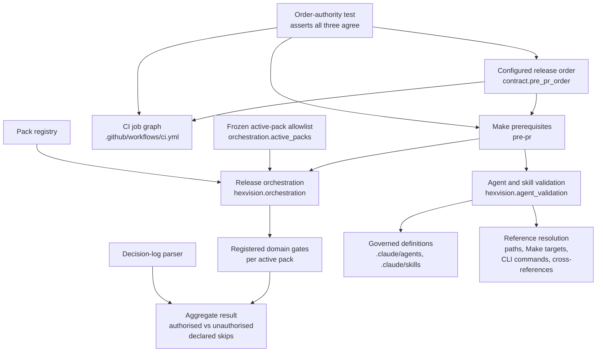

# C4 Level 3 — Components

**Audience:** core maintainers, pack authors, and reviewers
**Classification:** technical architecture

## Gate engine and result model

`run_gate` turns expected `HexVisionError` and unexpected exceptions into a non-passing `GateResult`; it does not permit an unavailable tool or input to become a pass. Gates provide expected policy failures directly. The CLI serializes the resulting stable result model and maps its terminal status to the documented process exit code.

## Pack and verifier registries

Packs are entry-point-discovered instances of the `Pack` abstract base class. `load_all()` refuses partial discovery if an advertised pack is broken. Domain gates are returned by the loaded pack and run through the common runner. Invariant verifiers are a separate entry-point registry: conformance selects exactly one supporting verifier and requires its negative probe to produce the configured evidence.

Projection renderers are deliberately different: `hexvision.projections` has an in-process decorator registry for the built-in Markdown roadmap and Jira-style CSV renderers. It is dynamic lookup driven by configuration, not Python entry-point discovery.

## Release orchestration and agent governance

Release orchestration executes every registered domain gate for each pack named in the frozen `orchestration.active_packs` allowlist, so a pack that is merely installed cannot enter the release path without review. Its aggregate distinguishes a declared absence that carries an authorising decision-log entry, which passes and is listed against that decision, from one that does not, which fails and names its gate.

The configured order is the single authority for what runs and in what sequence. The Make prerequisite list and the CI job graph are both derived views, and a test asserts all three agree, so a gate added to one cannot silently go unenforced in the others. This is the defect that previously left the robotics domain gates reachable only from tests.

Agent and skill validation treats governed definitions as artifacts with a schema rather than as prose. It checks frontmatter fields, description bounds, and that every referenced file path, Make target, CLI command, and agent or skill cross-reference resolves against the real checkout, so a definition cannot drift from the repository it describes. It reads its own policy file and enumerates nothing, so adding an agent does not require editing a test.
