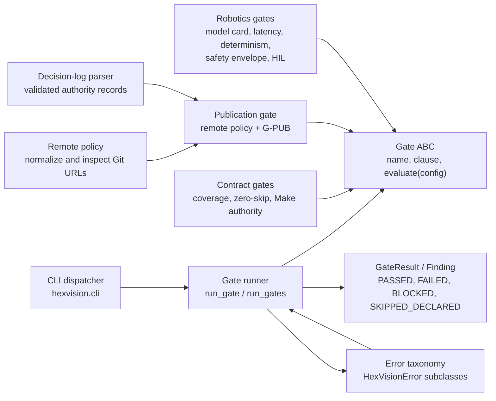
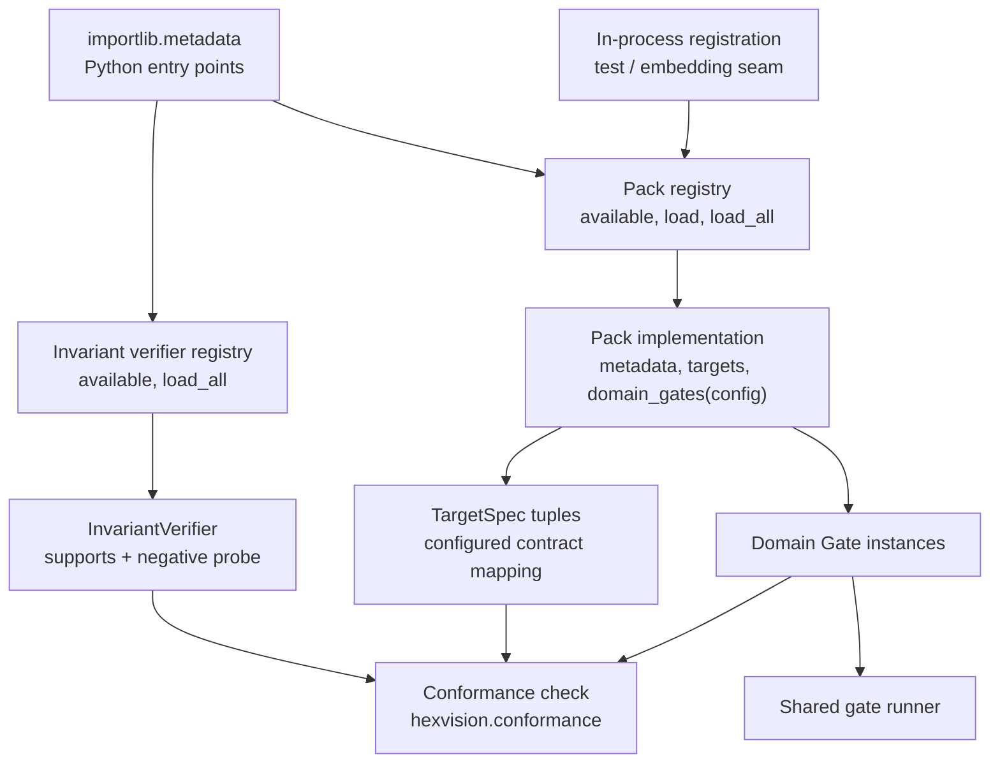

# C4 Level 3 — Components

**Audience:** core maintainers, pack authors, and reviewers
**Classification:** technical architecture

## Gate engine and result model

`run_gate` turns expected `HexVisionError` and unexpected exceptions into a non-passing `GateResult`; it does not permit an unavailable tool or input to become a pass. Gates provide expected policy failures directly. The CLI serializes the resulting stable result model and maps its terminal status to the documented process exit code.

## Pack and verifier registries

Packs are entry-point-discovered instances of the `Pack` abstract base class. `load_all()` refuses partial discovery if an advertised pack is broken. Domain gates are returned by the loaded pack and run through the common runner. Invariant verifiers are a separate entry-point registry: conformance selects exactly one supporting verifier and requires its negative probe to produce the configured evidence.

Projection renderers are deliberately different: `hexvision.projections` has an in-process decorator registry for the built-in Markdown roadmap and Jira-style CSV renderers. It is dynamic lookup driven by configuration, not Python entry-point discovery.
