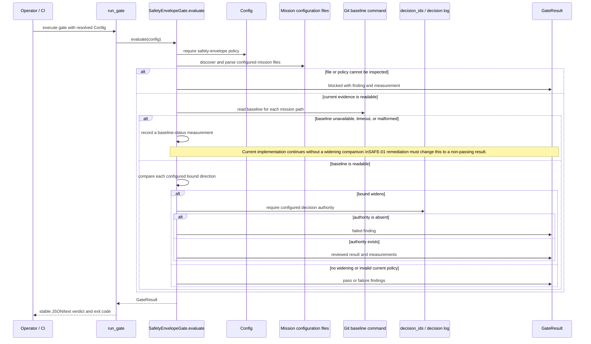

# C4 Level 4 — Safety-relevant code path

**Audience:** robotics safety reviewers, core maintainers, and incident responders
**Classification:** technical architecture

The safety-envelope gate is the most safety-relevant repository-evidence path. It evaluates mission configuration and the committed baseline; it does not call a vehicle, simulator, or actuator. The code path below reflects `hexvision.robotics.safety_envelope.SafetyEnvelopeGate`, the shared runner, the decision-log parser, and the common result model **as implemented at this revision**. The baseline-unavailable branch is intentionally shown as a recorded measurement because GAP-01/SAFE-01 remediation is owned by the safety workstream; this C4 document does not pretend that pending behavior has landed.

Safety decisions are explicit per bound. The implementation uses the configured direction and failsafe-strength policy rather than a generic “larger is worse” rule. A failure means evidence was read and violated policy; a blocked result means the harness could not make the required inspection. Both are release-stopping and retain different incident meaning.
